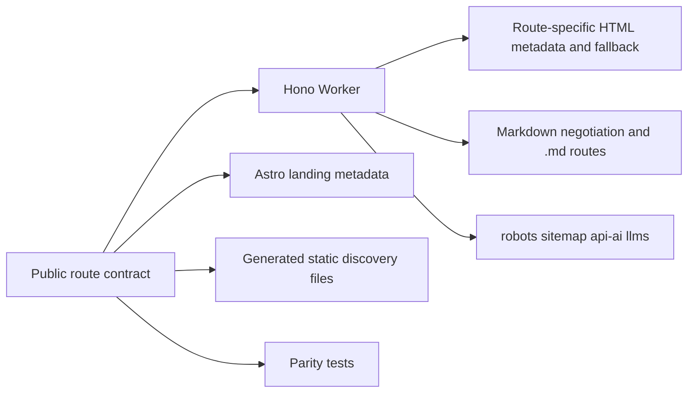

## Context

Open Historia is a Vite SPA behind a Hono Cloudflare Worker, with an Astro
landing overlaid at `/`. The Worker serves the same `app.html` for `/play`,
`/about`, `/privacy`, and state-bearing `/play/:id`, so non-home responses have
generic metadata and no crawlable body before JavaScript. Static discovery
files currently duplicate route lists and disagree about the production
domain.

## Goals / Non-Goals

**Goals:**

- Make four public HTML routes discoverable and fully agent-readable.
- Keep saves, campaign identifiers, APIs, auth, and archived experiments
  private or non-indexed.
- Derive sitemap, catalog, Markdown, metadata, and fallback HTML from one
  portable source.
- Preserve the existing SPA and Astro visual experiences after JavaScript
  loads.

**Non-Goals:**

- Rendering, summarizing, or indexing saved campaign state.
- Reintroducing Story Rooms.
- Changing gameplay, data models, auth, AI providers, or deployment.
- Adding production dependencies.

## Decisions

### Use a portable root route contract

A pure ESM module will describe the four public routes, their metadata,
structured content, sitemap priority, and ownership. Both Worker code and
build-time generation can import it without React or Cloudflare dependencies.
Maintaining separate JSON and XML files was rejected because it caused the
current domain and coverage drift.

### Treat only the public game entry as indexable

`/play` describes the game and is a canonical public app entry. `/play/:id`
can identify a saved or resumed campaign and will receive `noindex` metadata,
canonicalize to `/play`, and remain absent from sitemap, catalog, and Markdown.
All save and auth APIs remain excluded.

### Transform the SPA shell at the Worker boundary

The Worker will use `HTMLRewriter` to set route-correct metadata, structured
data, and server-visible fallback content inside `#root`. React replaces the
fallback when it mounts, so the visual application remains unchanged while
non-JavaScript crawlers receive meaningful HTML. Creating four separately
built SPA entrypoints was rejected because it duplicates the app shell and
build configuration.

### Generate discovery responses at request time

The Worker will answer robots, sitemap, catalog, LLM indexes, `.md` alternates,
and Markdown content negotiation from the contract. It will bind absolute URLs
to the request origin so local and preview audits remain same-origin while HTML
canonicals continue to use `https://historia.aliveville.com`.

## Risks / Trade-offs

- **[Risk] HTMLRewriter fallback differs from the hydrated React page** →
  Keep fallback copy at product-summary level and test route metadata/parity,
  not pixel output.
- **[Risk] State-bearing campaign routes leak into discovery** → Use exact
  public path parsing and explicit tests for `/play/:id`, save APIs, auth, and
  Story Rooms.
- **[Risk] Static files under `public/` drift from Worker responses** →
  Generate checked-in files from the contract and test them against the same
  renderers.
- **[Risk] Request-origin catalogs advertise previews** → Rebinding is
  intentional for preview/local integrity; production requests naturally emit
  the owned domain.

## Migration Plan

1. Add the contract, generation script, Worker response/rendering helpers, and
   tests.
2. Regenerate checked-in discovery files and build the Vite/Astro production
   assets.
3. Run local SEO and agent-readiness audits.
4. Merge through the normal pull-request path. No deployment is part of this
   change; rollback is a revert of the merge commit.

## Open Questions

None. The explicit four-route inventory and private gameplay boundary are
fully defined by issue #15.
